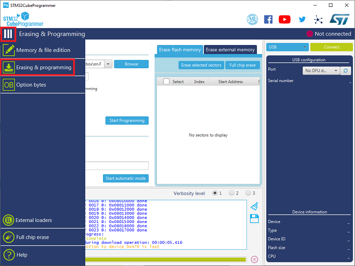
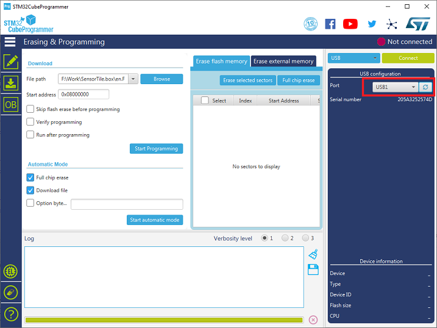
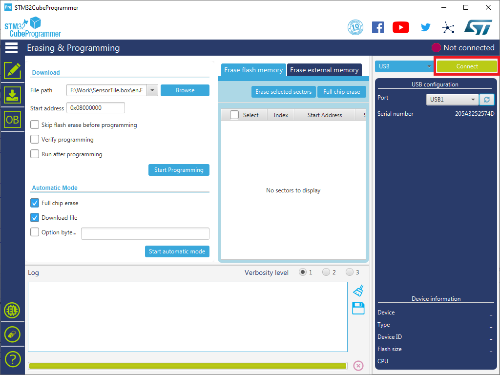
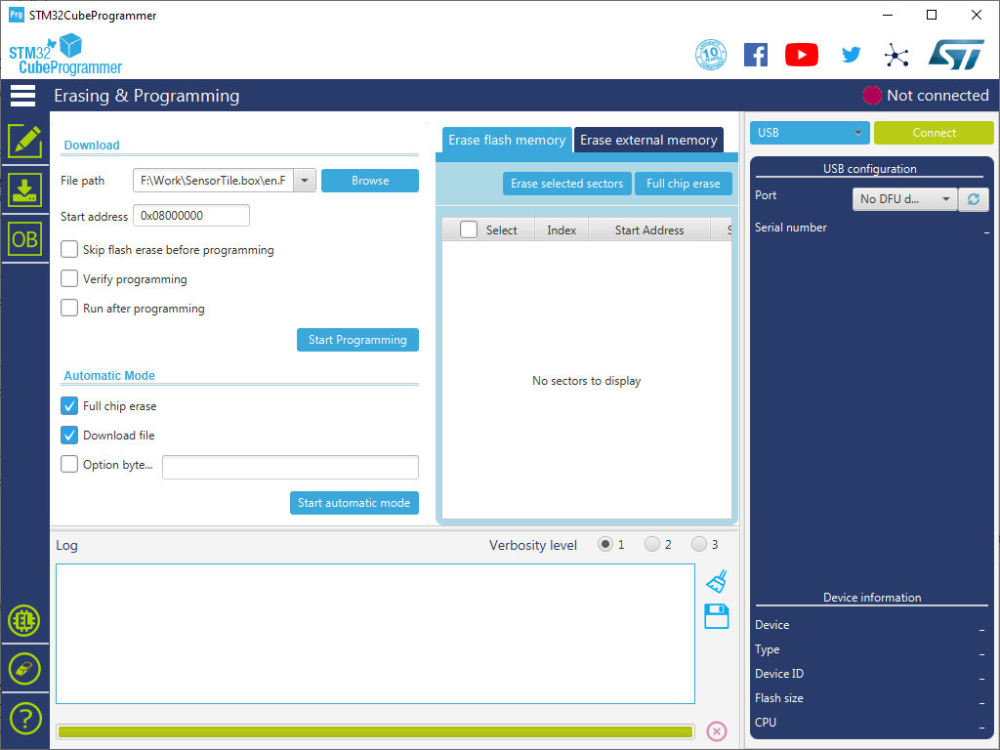
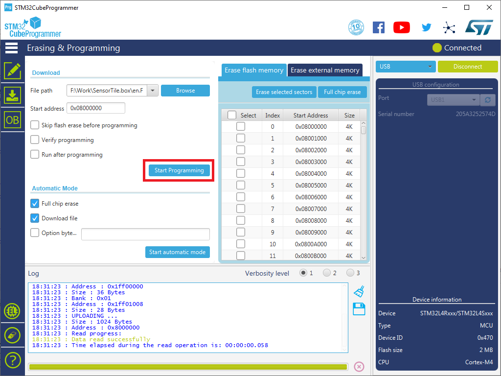
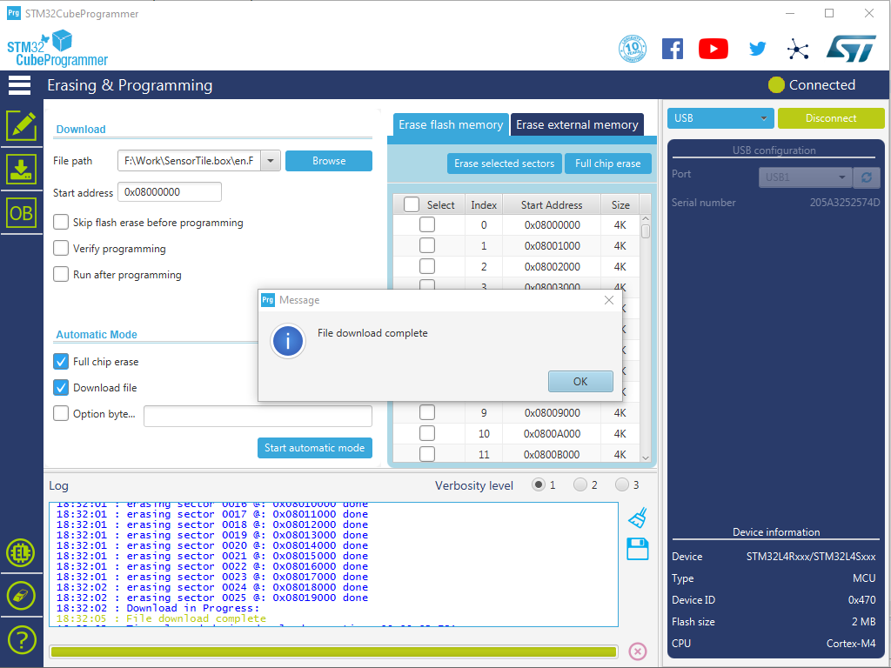

# SensorTile

## Tools

1. SensorTile.Box
    - Read sensor data over USB

1. PC
    - Run an app to read sensor data from SensorTile.Box over USB
    - Tested with Windows 10 and Ubuntu 18.04

1. STM32CubeProgrammer
    - Download and install STM32CubeProgrammer from <https://www.st.com/ja/development-tools/stm32cubeprog.html>
    - Tool is used to flash the firmware

1. STM32CubeIDE  
    - Optional : To compile the firmware
    - Download and install STM32CubeID from <https://www.st.com/ja/development-tools/stm32cubeide.html>
    - Tested with version 1.3.1

1. FP-SNS-STBOX1 firmware package
    - Optional : To write your own firmware code
    - Download and extract the firmware package from <https://www.st.com/en/embedded-software/fp-sns-stbox1.html>
    - Tested with version 1.3.0

1. Visual Studio 2019
    - Optional : To compile sample app

1. USB Type-A to Micro-USB cable
    - To connect your PC and SensorTile.Box

## Pre-compiled Firmware

The pre-compiled firmware is based on DataLogExtended project in the firmware package.

Clone this repo or download from <https://github.com/daisukeiot/SensorTile/raw/master/Firmware/pnpdemo_v1.2.bin>

## Flashing Firmware

1. Prepare the firmware  

    - Download the pre-compiled firmware from <https://github.com/daisukeiot/SensorTile/raw/master/Firmware/pnpdemo_v1.2.bin>  
    or
    - Compile your own firmware with STM32CubeIDE + FP-SNS-STBOX1

1. Launch STM32CubeProgrammer and Open **Erasing & programming** tab

    

1. Boot Sensor into DFU mode

    Hold `Boot` button then connect sensor to the PC with USB cable

    

1. Make sure STM3CubeProgrammer detects the sensor

    If not, click the circle icon

    

    Once it is recognized, you should see `Port` = `USBx` and the serial number of SensorTile.Box

1. Press `Connect` button to connect to SensorTile.Box

    

1. Browse the firmware file  
    If you clone this repo, use **pnpdemo_v1.2.bin** in **Firmware** folder

    


1. Press "Start Programming` to flash the firmware

    

1. Confirm file is successfully downloadd (Flashed)

    

1. Disconnect SensorTile.Box

## Reading Sensor Data over USB

The sample firmware requires following steps :

1. Open Serial Port
1. Initialize sensors
1. Optional : Synchronize RTC with your PC
1. Read sensor data

or 

Run [Sample Console App](SensorTile-Console/README.md) in <https://github.com/daisukeiot/SensorTile/blob/master/SensorTile-Console/executable/SensorTile.Console.exe>

```cmd

SensorTile.Console.exe -c <Serial Port Number>
```

### Example

```
Serial Port   : \\.\COM3 Opened
System Time   : 2020/06/01 12:09:26
Sensor String : SensorTile.Box for IoT Plug and Play Demo v1.1
Sensor init   : Success
Accelerometer : M6DSOX
Gyroscope     : M6DSOX
Magnetometer  : S2MDL
Temperature   : S221
Humidity      : S221
Pressure      : S22HH
Time : 20/06/01 12:09:26.08 : Flag 3f : Pre 1019.8 Pa / Temp 28.2 C / Hum 36.3 % / Acc x  -303 y    12 z  -940 / Gyro x    -140 y    -140 z    -630 / Mag x -612 y  -72 z  615
Time : 20/06/01 12:09:26.58 : Flag 3f : Pre 1019.9 Pa / Temp 28.2 C / Hum 36.3 % / Acc x  -301 y    12 z  -941 / Gyro x    -140 y     210 z    -560 / Mag x -616 y  -73 z  606
Time : 20/06/01 12:09:27.56 : Flag 3f : Pre 1019.8 Pa / Temp 28.2 C / Hum 36.3 % / Acc x  -301 y    12 z  -940 / Gyro x     -70 y     140 z    -560 / Mag x -622 y  -64 z  619
```