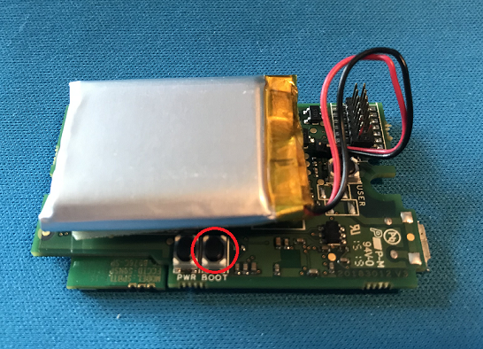

# SensorTile

## Tools

1. SensorTile.Box
    - Read sensor data over USB

1. PC
    - Run an app to read sensor data from SensorTile.Box over USB
    - Tested with Windows 10 and Ubuntu 18.04

1. STM32CubeProgrammer
    - Download and install STM32CubeProgrammer from <https://www.st.com/ja/development-tools/stm32cubeprog.html>
    - Tool is used to flash the firmware

1. STM32CubeIDE  
    - Optional : To compile the firmware
    - Download and install STM32CubeID from <https://www.st.com/ja/development-tools/stm32cubeide.html>
    - Tested with version 1.3.1

1. FP-SNS-STBOX1 firmware package
    - Optional : To write your own firmware code
    - Download and extract the firmware package from <https://www.st.com/en/embedded-software/fp-sns-stbox1.html>
    - Tested with version 1.3.0

1. Visual Studio 2019
    - Optional : To compile sample app

1. USB Type-A to Micro-USB cable
    - To connect your PC and SensorTile.Box

## Pre-compiled Firmware

The pre-compiled firmware is based on DataLogExtended project in the firmware package.

Clone this repo or download from <https://github.com/daisukeiot/SensorTile/raw/master/Firmware/pnpdemo_v1.1.bin>

## Flashing Firmware

1. Prepare the firmware  

    - Download the pre-compiled firmware from <https://github.com/daisukeiot/SensorTile/raw/master/Firmware/pnpdemo_v1.1.bin>  
    or
    - Compile your own firmware with STM32CubeIDE + FP-SNS-STBOX1

1. Launch STM32CubeProgrammer and Open **Erasing & programming** tab

    

1. Boot Sensor into DFU mode

    Hold `Boot` button then connect sensor to the PC with USB cable

    

1. Make sure STM3CubeProgrammer detects the sensor

    If not, click the circle icon

    

    Once it is recognized, you should see `Port` = `USBx` and the serial number of SensorTile.Box

1. Press `Connect` button to connect to SensorTile.Box

    

1. Browse the firmware file  
    If you clone this repo, use **pnpdemo_v1.1.bin** in **Firmware** folder

    


1. Press "Start Programming` to flash the firmware

    

1. Confirm file is successfully downloadd (Flashed)

    

1. Disconnect SensorTile.Box

## Reading Sensor Data over USB

The sample firmware requires following steps :

1. Open Serial Port
1. Initialize sensors
1. Optional : Synchronize RTC with your PC
1. Read sensor data

or 

Run [Sample Console App](SensorTile-Console/README.md) in <https://github.com/daisukeiot/SensorTile/blob/master/SensorTile-Console/executable/SensorTile.Console.exe>

```cmd

SensorTile.Console.exe -c <Serial Port Number>
```

### Example

```
C:\Repo\Git\SensorTile\SensorTile-Console\executable>SensorTile.Console.exe -c 3
Serial Port   : \\.\COM3 Opened
System Time   : 18:07:01
Sensor String : SensorTile.Box for IoT Plug and Play Demo v1.1
Sensor init   : Success
Accelerometer : M6DSOX
Gyroscope     : M6DSOX
Magnetometer  : S2MDL
Temperature   : S221
Humidity      : S221
Pressure      : S22HH
Time : 18:07:01.13 : Flag 3f : Pre 1018.0 Pa / Temp 37.6 C / Hum 31.6 % / Acc x  -824 y  -551 z   -50 / Gyro x   -1470 y     910 z   -1190 / Mag x  -30 y  -15 z -223
Time : 18:07:01.63 : Flag 3f : Pre 1017.9 Pa / Temp 37.6 C / Hum 31.6 % / Acc x  -828 y  -549 z   -45 / Gyro x    -910 y     560 z    -980 / Mag x  -27 y  -33 z -226
Time : 18:07:02.12 : Flag 3f : Pre 1017.9 Pa / Temp 37.6 C / Hum 31.6 % / Acc x  -829 y  -548 z   -43 / Gyro x    -140 y     210 z    -560 / Mag x  -37 y  -40 z -222
Time : 18:07:03.09 : Flag 3f : Pre 1017.8 Pa / Temp 37.7 C / Hum 31.5 % / Acc x  -827 y  -548 z   -42 / Gyro x    -280 y     210 z    -630 / Mag x  -34 y  -37 z -223
Time : 18:07:04.07 : Flag 3f : Pre 1017.9 Pa / Temp 37.6 C / Hum 31.4 % / Acc x  -827 y  -550 z   -43 / Gyro x    -140 y      70 z    -560 / Mag x  -31 y  -39 z -223
Time : 18:07:05.04 : Flag 3f : Pre 1017.9 Pa / Temp 37.7 C / Hum 31.4 % / Acc x  -827 y  -549 z   -47 / Gyro x     -70 y     140 z    -560 / Mag x  -30 y  -42 z -229
Time : 18:07:06.02 : Flag 3f : Pre 1017.9 Pa / Temp 37.7 C / Hum 31.3 % / Acc x  -827 y  -550 z   -48 / Gyro x    -210 y     210 z    -630 / Mag x  -22 y  -27 z -226
Time : 18:07:06.99 : Flag 3f : Pre 1017.9 Pa / Temp 37.7 C / Hum 31.2 % / Acc x  -827 y  -549 z   -46 / Gyro x     -70 y     140 z    -490 / Mag x  -34 y  -28 z -225
Time : 18:07:07.97 : Flag 3f : Pre 1017.9 Pa / Temp 37.7 C / Hum 31.2 % / Acc x  -827 y  -548 z   -43 / Gyro x    -210 y     140 z    -560 / Mag x  -39 y  -46 z -232
Time : 18:07:08.94 : Flag 3f : Pre 1017.8 Pa / Temp 37.8 C / Hum 31.1 % / Acc x  -827 y  -549 z   -45 / Gyro x    -140 y     140 z    -560 / Mag x  -34 y  -37 z -229
Time : 18:07:09.91 : Flag 3f : Pre 1017.9 Pa / Temp 37.8 C / Hum 31.0 % / Acc x  -827 y  -550 z   -46 / Gyro x    -210 y     280 z    -630 / Mag x  -39 y  -25 z -229
Time : 18:07:10.88 : Flag 3f : Pre 1017.8 Pa / Temp 37.8 C / Hum 31.0 % / Acc x  -828 y  -550 z   -46 / Gyro x     -70 y     210 z    -490 / Mag x  -28 y  -45 z -220
```